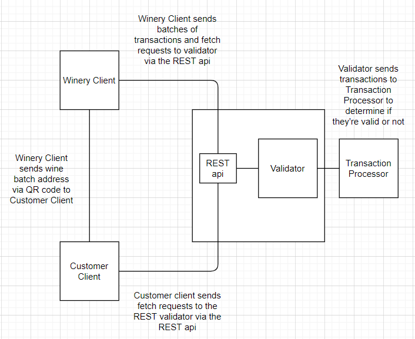

# cs46X_18_BlockchainForOregonWines
Our project consists of these components

1:     A node (the docker-yaml file containerizes all of the components of the node) = The node was constructed using the Hyperledger Sawtooth     javascript SDK.  It has a REST-api and a validator. 
    The REST-api receives requests from our applications and sends them to the validator.  The validator checks the permissions
    of the signing key used to sign an received batch.  Additionally, it uses the attached digital signature to check the integrity
    of data.  Also, it checks the structure of a batch.  It also (along with the transaction processor) manages the state database and the
    blockchain.  After making these checks, it transmits the transactions in the batch (which have been unwrapped) to the transaction processor.

2:  Transaction Processor (This is in the processor folder) = We wrote our transaction processor using JS and Node.js.  It takes incoming transactions and runs them through a series of "business rules".
    Essentially, it determines whether an incoming transaction is valid or invalid.  If it is valid, it updates the state and notifies the validator that the transaction
    is complete.  If the transaction is invalid, the transaction processor communicates this to the validator (but the state database isn't updated).

3:  Winery Client (this is in the client folder) = The winery client was written using JS and Node.js.  It is a web application that allows wineries to interact with the blockchain.  Wineries can fetch wine info from the blockchain and
    create, delete, and edit wine batches that have been added to the blockchain.  Also, QR codes can be generated from wine batches.  When scanned, these QR codes contain URLs that lead to the Customer Client.  The Customer Client will
    display information about the wine batch that was used to generate the QR code.

4:  Customer Client (this is in the custClient folder) = The customer client fetches information from the blockchain (it uses an address that is
    included as a parameter in the url in the QR code) and then displays it for the customer.

